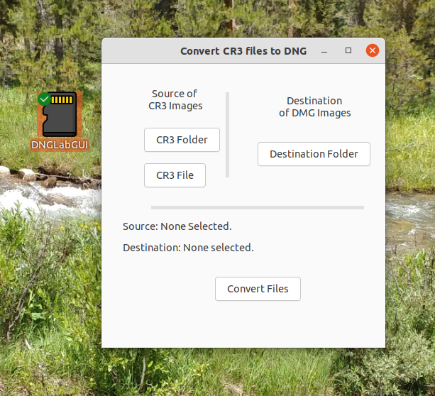

## <center> DNGLabGUI, a Simple GUI for dnglab ##
### <center>Convert Raw Canon CR3 Images into DNG Images ###
<center> 
    
This is a simple gui to help users not familiar with running programs from the terminal use dnglab to convert Canon .CR3 raw image files to the open format DNG format.  It has buttons where the user can select the folder of .CR3 images they want to convert (or the single image file to convert) and the destination folder for the images converted to DNG format.  Their new names will be the old name, but the extension will be .DNG instead of .CR3.  They can then be edited with darktable and other open source editors in Linux.  The conversion uses dnglab, a command line program this GUI opens up in gnome-terminal with the correct syntax to do the conversion the user specified with the GUI.  

#### Prerequisites for Installation ####
You need the following python packages:
- python3
- gnome-terminal
- libgtk-3-0
- python3-gi
- dnglab
    
You can install the first three of these prerequisites on ubuntu with:

```$ sudo apt install python3 gnome-terminal libgtk-3-0 python3-gi```
    
The last one to install is dnglab.  To install dnglab follow these steps:
1. Go to https://github.com/dnglab/dnglab/releases
2. Download the latest release.
3. Install in with ```$ sudo apt install <Put the release filename here.deb>```
    
#### Installation of the GUI: ####
The DNGLabGUI.py needs to be in the same directory as the glade XML file DNGLabGUI.glade. You need to make DNGLabGUI.py executable.  You can do that from the terminal with:
    
```$ chmod 755 DNGLabGUI.py``` 
    
or use the option in Files you get by right clicking DNGLabGUI.py and setting permissions to allow execution.  You may also have to right click on the .desktop file and enable it to be a launcher file.
    
The DNGLabGUI.desktop file allows you to launch the GUI from the launcher (Super Key or clicking the Activities if you are using Gnome).  You need to copy it to your Desktop folder, and your ~/.local/share/applications folder, but you also need to open it in an editor and change the Exec= line to go to where you put the DNGLabGUI.py and DNGLabGUI.glade files.  You also need to replace the /home/frohro with your home directory instead of mine in the Icon= if you want the icon to show up.  Sorry about this customization.  I haven't figured out the best way to distribute these .desktop files.  Unfortunately, without them, the whole purpose of this GUI is rather mute.
    
#### Usage ####
To convert a folder of Canon CR3 images to DNG images, run the GUI, click on the source folder button and select the folder containing the images that you wish to convert.  (It will only look in that folder for .CR3 images to convert.)  Then select the folder you wish to save the .DNG images in. Then click the "Convert Files" button to convert the images.  A gnome-terminal will open up and you can watch the progress there.  The dnglab program is working in that terminal.  If you have already converted the CR3 files so the destination folder has them already, it will not overwrite them, but gives you an error in the screen of the terminal.  Other problems are displayed there.  If you run the DNGLabGUI.py from the terminal yourself, it will print the dnglab command you use to convert them on the terminal so you can use that without the GUI if you like.  You can also read the documentation on github for DNGLab, and simply use it if you don't like GUI programs. I wrote this for my wife who prefers not to use the command line and terminal, and so she can edit the RAW files her new Canon camera creates using her Ubuntu OS.  